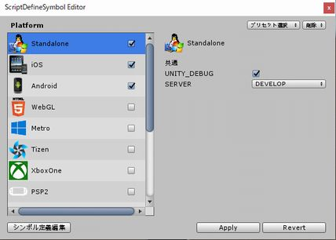
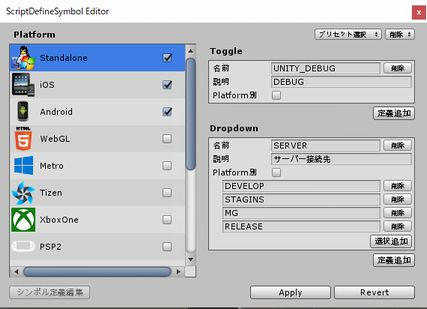

# DefineSymbolEditor
PlayerSettings の Script Define Symbols、直接編集するとtypoとか怖いですよね。 
一時的に未定義した後、元に戻すときにどんな名前だったか思い出すの億劫ですよね。 
というか設定まで遠くないですか？いちいち開くのﾒﾝﾄﾞｸｻｲ。 
そんな不安と不便を解決します。 

シンボル編集時

# 特徴

* トグル型とドロップダウン型の２つで簡単設定
* プリセット対応
* コマンドライン対応

# 使い方

MENU[Tools > Build > DefineSymbol Editor]

### シンボルの定義

1. [シンボル定義編集]でシンボルの編集画面へ
2. [Apply]で確定 [Revert]でキャンセル

### プラットフォームを選択

1. 左側のプラットフォーム一覧からシンボル設定を有効にしたい奴にチェック

# コマンドライン

* DefineSymbolEditorCommandLineToolクラスからアクセス(まだ貧弱)

# License

MIT License
